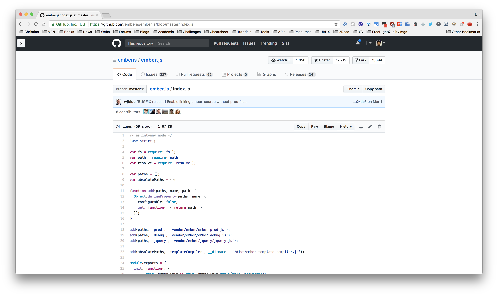
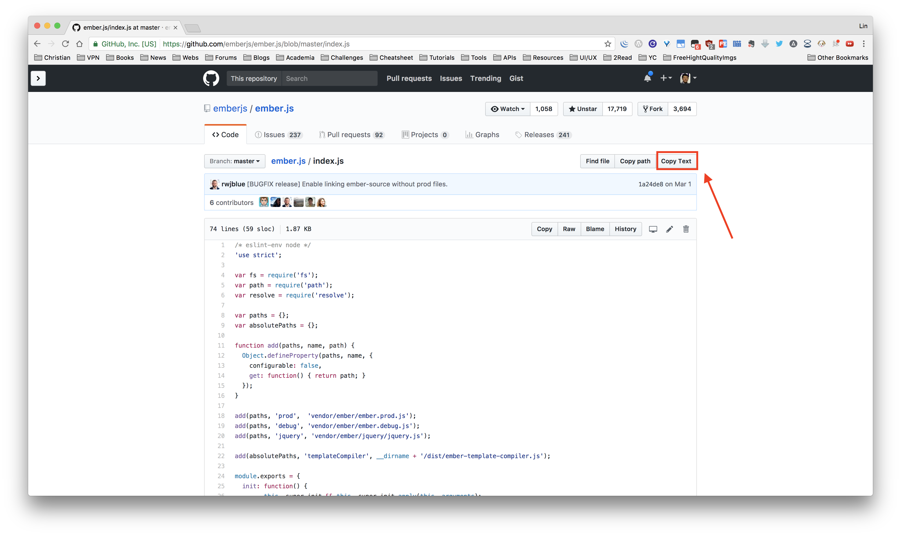

# README

**Story**: I want to make it easier to copy files without opening raw.

I was inspired by [Select Code Block Buttons](https://gist.github.com/halirutan/2217e4685ae82d754b6c/) and created this tool.

## Instruction
1. Install Script Manager

  * Chrome: Tampermonkey or Violent monkey
  * Firefox: Greasemonkey or Tampermonkey
  * Safari: Tampermonkey

2. Click [here](./index.js) to install, or visit at [greasyfork](https://greasyfork.org/en/scripts/28623-copy-github-file-to-clipboard/code)

## Screenshots

Before

After

# LICENSE
MIT/Beerware
